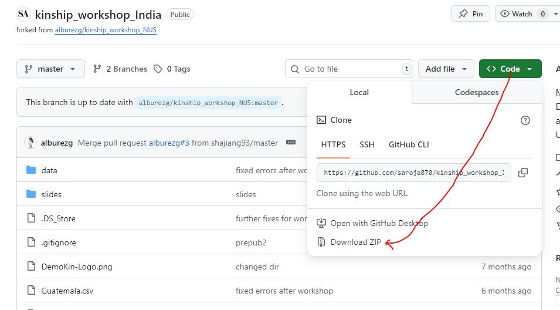

```{r 1 setup, include=FALSE}
knitr::opts_chunk$set(echo = TRUE,
                      message = FALSE, 
                      warning = FALSE, 
                      fig.align='center')

# Prevent scientific notation (useful for the rate calculation)
options(scipen=999999)
```


# {.tabset}
## Introduction 

### Preparation

Please make sure to complete the following preparatory steps before the training workshop:

1. If you haven't already, install R and RStudio. This is a useful tutorial: https://rstudio-education.github.io/hopr/starting.html 
1. Install the following packages in R:

```{r = installs, eval=FALSE}
install.packages("dplyr")
install.packages("tidyr")
install.packages("ggplot2")
install.packages("data.table")
install.packages("Matrix")
# install.packages("devtools")
devtools::install_github("IvanWilli/DemoKin")
```

1. Download the workshop's GitHub repository to your computer: https://github.com/alburezg/kinship_workshop_NUS. The easiest way is by clicking on `< > Code` and then `Download ZIP`, as shown below:

{width=800px}

1. Unzip the files and keep them somewhere at hand. 

## Part 1: Simple models

Kinship is a fundamental property of human populations and a key form of social structure.
Demographers have long been interested in the interplay between demographic change and family configuration.
This has led to the development of sophisticated methodological and conceptual approaches for the study of kinship, some of which are reviewed in this course. 

### 1. Installation

DemoKin is available on [CRAN](https://cran.r-project.org/web/packages/DemoKin/index.html), but we'll use the development version on [GitHub](https://github.com/IvanWilli/DemoKin):

```{r, eval=FALSE}
# install.packages("devtools")
devtools::install_github("IvanWilli/DemoKin")
```

Load packages that will be useful:

```{r, warning=F, message=FALSE}
library(dplyr)
library(tidyr)
library(ggplot2)
library(DemoKin)
```

Load a couple of functions we prepared:

```{r, warning=F, message=FALSE}
source("functions.R")
```

### 2. Demographic data

We will use data for Singapore from the [2024 Revision of the World Population Prospects](https://population.un.org/wpp/), which we pre-processed for this workshop.

```{r, warning=FALSE, message=FALSE}
#Load data for women
rates_female <- read.csv("data/sgp_female.csv", stringsAsFactors = F) #female rates
pop_female <- read.csv("data/sgp_popfemale.csv", stringsAsFactors = F) #female population (N)
# For data for men
rates_male <- read.csv("data/sgp_male.csv", stringsAsFactors = F) # male rates
pop_male <- read.csv("data/sgp_popmale.csv", stringsAsFactors = F) # male population (N)
```

Let's see what data we will be using. The first object is `rates_female`, a long-format data frame with year- and age-specific fertility rates ('fx') and survival probabilities from a life table ('px'). 

For women:

```{r, warning=FALSE, message=FALSE}
head(rates_female)
```

Let us visualise some of our demographic data. 
We start with the probability of dying between ages $x$ and $x+1$,$q_x$ in a life table for women:

```{r}
rates_female %>%
    filter(year %in% seq(1950, 2020, 30)) %>% 
    mutate(qx = 1-px) %>%
    ggplot() +
    geom_line(aes(x = age, y = qx, col = as.character(year)), linewidth = 1) +
    scale_y_log10() +
    labs(y = "Probability of dying, qx", col = NULL) +
    theme_bw() +
    theme(legend.position = "bottom")
```

Next, we have age-specific fertility rates for multiple years:

```{r}
rates_female %>%
  filter(year %in% seq(1950, 2020, 30)) %>% 
  ggplot() + 
  geom_line(aes(x = age, y = fx, col = as.character(year)), linewidth = 1) +
  labs(y = "Age-specific fertility rate, fx", col = NULL) +
  theme_bw() +
  theme(legend.position = "bottom")
```

Finally, we have the population counts:

```{r}
pop_female %>%
  mutate(age = 0:100) %>% 
  pivot_longer(-age, names_to = "year", values_to = "pop") %>% 
  mutate(year = gsub("X", "", year)) %>% 
  filter(year %in% seq(1950, 2020, 30)) %>% 
  ggplot() + 
  geom_line(aes(x = age, y = pop, col = as.character(year)), linewidth = 1) +
  labs(y = "Population alive in thousands", col = NULL) +
  theme_bw() +
  theme(legend.position = "bottom")
```

### 3. The DemoKin package

`DemoKin` can be used to compute the number and age distribution of Focal's relatives under a range of assumptions, including living and deceased kin. Let's explore the main functions.

#### 3.1. The function `kin()`

The function `DemoKin::kin()` currently does most of the heavy lifting in terms of implementing matrix kinship models.

For this example, we will run the simplest model, with the following assumptions: 

1. Rates are **time-invariant**; i.e., the same set of rates apply at all times. For this example, these will be the 2020 rates.
1. The population has one **one-sex**; i.e., we only use female data as input and trace descent through female lines.

First, we need to extract the data for women in 2020 and save it as a matrix:

```{r 21}
# First, reshape fertility and survival for a given year

asfr_2020 <- rates_female %>%
  filter(year == 2020) %>% 
  select(age, year, fx) %>%
  pivot_wider(names_from = year, values_from = fx) %>%
  select(-age) %>%
  as.matrix()

surv_2020 <- rates_female %>%
  filter(year == 2020) %>% 
  select(age, year, px) %>%
  pivot_wider(names_from = year, values_from = px) %>%
  select(-age) %>%
  as.matrix()
```

Now we can run the kinship models:

```{r 22}
kin_2020 <- kin(p = surv_2020, f = asfr_2020, time_invariant = TRUE)
```

#### 3.2. Arguments of `kin()`

- **p** numeric. A vector (atomic) or matrix of survival probabilities with rows as ages (and columns as years in case of matrix).
- **f** numeric. Same as U but for fertility rates.
- **time_invariant** logical. Assume time-invariant rates. Default TRUE.
- **output_kin** character. kin types to return: "m" for mother, "d" for daughter, ...

#### 3.3 Relative types

Relatives for the `output_kin` argument are identified by a unique code.
Note that the relationship codes used in `DemoKin` differ from those in Caswell [-@caswell_formal_2019]. 
The equivalence between the two set of codes is given in the following table:

```{r 23}
demokin_codes
```

#### 3.4. Value

`DemoKin::kin()` returns a list containing two data frames: `kin_full` and `kin_summary`. 

```{r 24}
str(kin_2020)
```

##### `kin_full` 

This data frame contains expected kin counts by year (or cohort), age of Focal, type of kin and, age of kin, including living and dead kin at that age.

```{r 25}
head(kin_2020$kin_full)
```

##### `kin_summary`

This is a 'summary' data frame derived from `kin_full`. To produce it, we sum over all ages of kin to produce a data frame of expected kin counts by year or cohort and age of Focal (but *not* by age of kin). 
This is how the `kin_summary` object is derived:

```{r 26, message=F}

kin_by_age_focal <- 
  kin_2020$kin_full %>% 
  group_by(kin, age_focal) %>% 
  summarise(count = sum(living)) %>% 
  ungroup()

# Check that they are identical (for living kin only here)

kin_by_age_focal %>% 
  select(kin, age_focal, count) %>% 
  identical(
    kin_2020$kin_summary %>% 
      select(kin, age_focal, count = count_living) %>% 
      arrange(kin, age_focal)
  )
```

#### 3.2. Kinship diagrams

We can visualize the kinship structure we just computed using a network or 'Keyfitz' kinship diagram [@Keyfitz2005] with the `plot_diagram` function. 
Let's see the expected number of living kin for a 65 yo woman in Singapore according to our model:

```{r 10, fig.height=10, fig.width=12}
kin_2020$kin_summary %>% 
  filter(age_focal == 65) %>% 
  select(kin, count = count_living) %>% 
  plot_diagram(rounding = 2)
```

## Part 2: Advanced models

Human males generally live shorter and reproduce later than females. 
These sex-specific processes affect kinship dynamics in a number of ways. 
For example, the degree to which an average member of the population, call her Focal, has a living grandparent is affected by differential mortality affecting the parental generation at older ages. 
We may also be interested in considering how kinship structures vary by Focal's sex: a male Focal may have a different number of grandchildren than a female Focal given differences in fertility by sex. 
Documenting these differences matters since women often face greater expectations to provide support and informal care to relatives.
As they live longer, they may find themselves at greater risk of being having no living kin.
The function `kin2sex` implements two-sex kinship models as introduced by Caswell [-@caswell_formal_2022]. 

### 1. Setup

Load packages: 

```{r 3, warning=F, message=FALSE}
# Packages
library(dplyr)
library(tidyr)
library(ggplot2)
library(DemoKin)
```

Load male and female data (restricting it to data in the 1950-2023 period):

```{r, warning=F, message=FALSE}
# Data
#Load data for women
rates_female <- read.csv("data/col_female.csv", stringsAsFactors = F) #female rates
pop_female <- read.csv("data/col_popfemale.csv", stringsAsFactors = F) #female population (N)
# For data for men
rates_male <- read.csv("data/col_male.csv", stringsAsFactors = F) # male rates
pop_male <- read.csv("data/col_popmale.csv", stringsAsFactors = F) # male population (N)
```

Since we're not running projections (yet), we'll keep only data in the 1950-2023 period:

```{r, warning=F, message=FALSE}
rates_female <- rates_female %>% filter(year <= 2023)
pop_female <- pop_female[ , 1:(2024-1950)]
rates_male <- rates_male %>% filter(year <= 2023)
pop_male <- pop_male[ , 1:(2024-1950)]
```

Note that for men there is no `fx` (fertility) column because the WPP does not provide it:

```{r, warning=FALSE, message=FALSE}
head(rates_male)
```

### 2. Run kinship model

#### 2.1. Convert data to matrices

Before running the model, we need to reshape the data to have matrices as input. 

```{r 40, message=FALSE, warning=FALSE }
# Female fertility
asfr_females <- 
  rates_female %>%
  select(age, year, fx) %>%
  pivot_wider(names_from = year, values_from = fx) %>%
  select(-age) %>%
  as.matrix()

# Female survival
surv_females <- 
  rates_female %>%
  select(age, year, px) %>%
  pivot_wider(names_from = year, values_from = px) %>%
  select(-age) %>%
  as.matrix()

# Male survival
surv_males <- 
  rates_male %>%
  select(age, year, px) %>%
  pivot_wider(names_from = year, values_from = px) %>%
  select(-age) %>%
  as.matrix()
```

The data now has years in columns and ages in rows. For example, male survival probabilities:

```{r}
surv_males[1:10, 1:6]
```

#### 2.2. Run model

> Be patient: this can take around 5-10 minutes to run...

```{r}
kin_out <- 
  kin2sex(
    # Survival probabilities of women
    pf = surv_females
    # Survival probabilities of men
    , pm = surv_males
    # Fertility rates for women
    , ff = asfr_females
    # Fertility rates for men (in this example, we use female rates)
    , fm = asfr_females
    # Female population counts
    , nf = pop_female
    # Male population counts
    , nm = pop_male
    # If FALSE, rates vary over time
    , time_invariant = FALSE
    # Which kin you want estimates for (see demokin_codes)
    , output_kin = c("c", "d", "gd", "ggd", "ggm", "gm", "m", "n", "a", "s")
    # The sex of the Focal or anchor invididual
    , sex_focal = "f"
    ) 
```

#### 2.3. Model assumptions

Our model assumes that: 

1. Rates vary over time (time-variant)
1. There are two sexes in the population (two-sex)
1. ***However**, since we don't have male fertility data from the UNWPP, we assume that male fertility is equivalent to female fertility (androgynous assumption)
1. Demographic rates are stable (time-invariant) before 1950 (the earliest observed data point) 

### 3. Kinship structures

The value returned by `kin2sex` is equivalent to the one returned by `kin`, with a couple new columns:

- `sex_kin` that distinguishes between male and female kin
- `year`: period (calendar) year
- `cohort`: birth cohort of Focal

```{r}
head(kin_out$kin_summary)
```

> A note on terminology:
The `kin2sex` function uses the same codes as `kin` to identify relatives (see `demokin_codes()` for reference).  
Please note that when running a two-sex model, the code "m" refers to either mothers or fathers!  
Use the `sex_kin` column to filter by the sex of a specific relative.  
For example, to consider only sons and ignore daughters, use:  

```{r}
kin_out$kin_summary %>%
  filter(kin == "d", sex_kin == "m") %>%
  head()
```

The two sex model provides kinship estimates by age, period, and birth cohort (of Focal) [@caswell_formal_2019]:


### 3.1. Cohort approach

Let's take a look at the resulting kin counts for a Focal born in 1960.
First, we plot total family size over the life course of Focal for all kin and irrespective of the sex of kin:

```{r}
kin_out$kin_summary %>%
  filter(cohort == 1960) %>% 
  rename_kin(sex = "2sex") %>% 
  summarise(count=sum(count_living), .by = c(kin_label, age_focal)) %>%
  ggplot(aes(age_focal, count, fill=kin_label)) +
  geom_area(colour = "black") +
  labs(y = "Expected number of living kin by Focal's age",
       x = "Age of a Focal born 1960") +
  theme_bw() +
    theme(legend.position = "bottom")
```

Now, we see the distribution of kin by sex of kin for a subset of kin:

```{r}
kin_out$kin_summary %>%
  filter(cohort == 1960) %>% 
  filter(kin%in% c("d", "gd", "m", "s")) %>% 
  rename_kin(sex = "2sex") %>% 
  summarise(count=sum(count_living), .by = c(kin_label, age_focal, sex_kin)) %>%
  ggplot(aes(age_focal, count, fill=sex_kin)) +
  geom_area() +
  theme_bw() +
  labs(y = "Expected number of living kin by sex and Focal's age",
       x = "Age of a Focal born 1960",
       fill = "Sex of Kin") +
  facet_wrap(~kin_label, scales = "free_y")
```

We now focus on the age distribution of kin. Note that we use the object `kin_full` for this:

```{r}
kin_out$kin_full %>%
  filter(age_focal == 60, cohort == 1960) %>% 
  filter(kin%in% c("d", "gd", "m", "s")) %>% 
  rename_kin(sex = "2sex") %>% 
  ggplot(aes(x = age_kin, y = living, colour = sex_kin)) +
  geom_line() +
  theme_bw() +
  labs(y = "Expected number of living kin for a 65 yo Focal born in 1960",
       x = "Age of kin",
       colour = "Sex of Kin") +
  facet_wrap(.~kin_label)
```

### 3.2. Period Approach

Let us take a `snapshot` of the kin distribution in 2023.
We can plot total family size over the life course of Focal for all kin and irrespective of the sex of kin:

```{r}
kin_out$kin_summary %>%
  filter(year == 2023) %>% 
  rename_kin(sex = "2sex") %>% 
  summarise(count=sum(count_living), .by = c(kin_label, age_focal)) %>%
  ggplot(aes(age_focal, count, fill=kin_label)) +
  geom_area(colour = "black") +
  labs(y = "Expected number of living kin by sex and Focal's age",
       x = "Age of Focal") +
  theme_bw() +
    theme(legend.position = "bottom")
```

Next, let's plot the number of kin over the life of Focal including the sex of kin for a selected number of kin:

```{r}
kin_out$kin_summary %>%
  filter(year == 2023) %>% 
  filter(kin %in% c("d", "gd", "m", "s")) %>% 
  rename_kin(sex = "2sex") %>% 
  summarise(count=sum(count_living), .by = c(kin_label, age_focal, sex_kin)) %>%
  ggplot(aes(age_focal, count, fill=sex_kin)) +
  geom_area() +
  theme_bw() +
  labs(y = "Expected number of living kin by sex and Focal's age",
       x = "Age of Focal",
       fill = "Sex of Kin") +
  facet_wrap(~kin_label, scales = "free_y")
```

## Part 3: Projections

### 1. Setup

Load packages: 

```{r, warning=F, message=FALSE}
# Packages
library(dplyr)
library(tidyr)
library(ggplot2)
library(Matrix)
library(DemoKin)
```

### Projections of kinship structure

Load male and female data:

```{r, warning=F, message=FALSE}
# Data
#Load data for women
rates_female <- read.csv("data/col_female.csv", stringsAsFactors = F) #female rates
pop_female <- read.csv("data/col_popfemale.csv", stringsAsFactors = F) #female population (N)
# For data for men
rates_male <- read.csv("data/col_male.csv", stringsAsFactors = F) # male rates
pop_male <- read.csv("data/col_popmale.csv", stringsAsFactors = F) # male population (N)
```

### 2. Projections of kinship by educational attainment

### 2.1. Multistate models in `DemoKin`

Since the inception of Caswell's [@caswell_formal_2019] proposed one-sex time-invariant age-structured matrix model 
of kinship, there have been many extensions to the framework (many of which are documented within this package). 
Caswell [-@caswell_formal_2021] updated the original model to incorporate time-varying vital rates, 
Caswell [-@caswell_formal_2022] introduced two-sexes to the model, 
and Caswell [-@caswell_formal_2020] considered a multi-stage population of kin. 
Here, we provide an R function which combines the three aforementioned models. 

Here, we'll demonstrate how the function `kin_multi_stage_time_variant_2sex` computes stage-specific kinship networks encompassing both sexes for an average member of a population, the sex of whom is user specified, and who is subject to time-varying demographic rates. We call this individual Focal. 
We seek the number of, age, and stage distribution of Focal's relatives, for each age of Focal's life, and as a function of the year in which Focal is born.

In this example we use education as an example stage. Singaporean data ranging from 2020 - 2090 is sourced from the [Wittgenstein Center](https://www.wittgensteincentre.org/en/index.htm). The data is aggregated into 5-year age group and 5-year time interval.

Some simplifying assumptions we make due to data availability are as follows:

1. Fertility rates vary with time, are distinct among education class, but the same over sexes (the so-called ``androgynous approximation'').
1. The age-specific transition probability across educational categories vary with time, but are the same over sex (androgynous approximation again)
1. Since there is no transition probability beyond age 15, we assume that at age 5-9, every individual transits from "no education" to "incomplete primary", and at age 10-14, every individual transits from "incomplete primary" to "primary" ("compulsory primamry education assumption due to Swedish reality").

In order to implement the model, the function `kin_multi_stage_time_variant_2sex` expects the following 7 inputs of vital rates, fed in as lists:

1. `U_list_females` A list of female age-and-education specific survival probabilities over the timescale (in matrix forms).
This input list has length = the timescale, and each entry represents the rates of a specific period in matrix form: stage columns, age rows.

1.`U_list_males` A list of male age-and-education specific survival probabilities over the timescale (in matrix forms).
This input list has length = the timescale, and each entry represents the rates of a specific period in matrix form: stage columns, age rows.

1. `F_list_females` A list of female age-and-education specific fertility rates over the timescale (in matrix forms).
This input list has length = the timescale, and each entry represents the rates of a specific period in matrix form: stage columns, age rows.

1. `F_list_males` A list of male age-and-education specific fertility rates over the timescale (in matrix forms).
This input list has length = the timescale, and each entry represents the rates of a specific period in matrix form: stage columns, age rows.

1. `T_list_females` A list of lists of female age-specific probabilities of moving up education over the timescale (in matrix forms).
The outer list has length = the timescale. The inner list has length = number of ages. 
Each outer list entry is comprised of a list of matrices (stage*stage dimensional), each matrix describes age-specific probabilities of moving stage. 
Thus for each year, we have a list of age-specific probabilities of moving from one stage to the next.

1. Same as 5) but for males

1. `H_list` A list of length = timescale, in which each element is a matrix which assigns the offspring of individuals in some stage to the appropriate age class (age in rows and states in columns)

To avoid the need for tedious calculations to put data into such format in this vignette, these lists are constructed  in another file and simply imported below. The code below reads in the above function input lists.

```{r eval=TRUE, message=FALSE, warning=FALSE, include=TRUE}
load("data/singapore_edu.rdata")
```

Recap: above are lists of period-specific demographic rates, in particular comprising:

`U_mat_fem_edu`: list of age by stage matrices, entries give female probability of survival.
List starting 2020 ending 2090 for every 5 years.

`U_mat_male_edu`: list of age by stage matrices, entries give female probability of survival.
List starting 2020 ending 2090.

`F_mat_fem_edu`: list of age by stage matrices, entries give female fert,
List starting  2020 ending 2090.

`F_mat_male_edu` == `F_mat_fem_edu`.

`T_mat_fem_edu`: list of lists of matrices: Each outer list entry is a list of matrices where each matrix gives age-specific probabilities 
a female moves up parity (inner list has length of number of age-classes).
Outer list starting 2020 ending 2090.

`T_mat_male_edu` == T_mat_fem_edu.

`H_mat`: list of matrices which redistributes newborns to age-class 1 and "no education". No time-variation.

### 1. Accumulated number of kin Focal expects over the lifecourse under time-varying rates from 2020 to 2090 ###

We feed the above inputs into the matrix model, along with other arguments:

-   Swedish proportion of female births `birth_female` = 1/(1.055+1), because the sex ratio at birth is around 1.055
-   We are not considering parity --> `parity` = FALSE
-   We want some of Focal's kin network --> `output_kin` = c("d", "gd", "m", "s")
-   Accumulated kin in this example --> `summary_kin` = TRUE
-   Focal is female --> `sex_Focal` = "Female"
-   Focal born into "no education" category --> `initial_stage_Focal` = 1
-   timescale as ouptut -- > `output_years` = seq(1,(1+no_years),2), which is complicated for time range with larger than 1 intervals

Accumulated kin are outputted by the argument `summary_kin` = TRUE. In such cases, for each age of Focal, we sum over all possible ages of kin yielding the marginal stage 
distribution of kin. 

The first sets of time-varying vital rates in our input lists are e.g., U_mat_fem[[1]] (corresponding to mortality in 2020), 
the 14-st entry is U_mat_fem[[(1+14)]] (mortality in 2020+14*5 = 2090). We require consistency between the length of the list of vital rates and the timescale: U_mat_fem[[1:(1+10)]] = in length = seq(2020,2090,5). Therefore we use the input lists of demographic rates

`U_list_females` = U_mat_fem[1:(1+no_years)] which runs from U_mat_fem[[1]] = 2020 set of rates, up to U_mat_fem[[14]] = 2090 set of rates, 
and so on...

> this run takes some time (ca. 5 min)

```{r, message=FALSE, warning=FALSE}
# Run kinship model for a female Focal over a timescale of no_years
time_range <- seq(2020,2090,5)
no_years <- length(time_range)-1
output_year_select <- seq(1, no_years+1, 2)

# since we use 5-year time frame, we are projecting from 2020 to 2020+5*14 = 2090
# We decide here to count accumulated kin by age of Focal, and not distributions of kin
kin_out_2020_2090 <-
  kin_multi_stage_time_variant_2sex(U_list_females = U_mat_fem_edu[1:(1+no_years)],
                                    U_list_males = U_mat_male_edu[1:(1+no_years)],
                                    F_list_females = F_mat_fem_edu[1:(1+no_years)],
                                    F_list_males = F_mat_male_edu[1:(1+no_years)],
                                    T_list_females = T_mat_fem_edu[1:(1+no_years)],
                                    T_list_males = T_mat_fem_edu[1:(1+no_years)],
                                    H_list = H_mat_edu[1:(1+no_years)],
                                    birth_female = 1/(1.055+1), ## Sex ratio -- Sweden value
                                    parity = FALSE,
                                    # Currently not working--sorry!
                                    # output_kin = c("c", "d", "gd", "ggd", "ggm", "gm", "m", "n", "a", "s"),
                                    summary_kin = TRUE,
                                    sex_Focal = "Female", ##  define Focal's sex at birth
                                    initial_stage_Focal = 1, ## Define Focal's stage at birth
                                    output_years = output_year_select # it seems tricky to set up output years when the time interval is not 1
                                    # now I select every 10 year for output
)
```

No we have to recode year and age related variables.

```{r, message=FALSE, warning=FALSE}
# also need to change the age_focal and year variables accordingly
kin_out_2020_2090$kin_summary <- 
  kin_out_2020_2090$kin_summary %>%
  mutate(year = (year-1)*5+min(time_range),
         age_focal = age_focal*5,
         cohort = year - age_focal,
         stage_kin = factor(stage_kin, levels = c(1, 2, 3, 4, 5, 6),
                       labels = c(
                         "no education",
                         "incomplete primary",
                         "primary",
                         "lower secondary",
                         "upper secondary",
                         "post-secondary"
                       )))

```

### 2.2. Number of living kin by education of kin

Notice the structure of the output data. We have columns `age_focal` and `kin_stage` because we sum over all ages of kin, and produce the marginal stage distribution given age of Focal. We have a column corresponding to sex of kin `sex_kin`, a column showing which `year` we are considering, and a column headed `group` which selects the kin type. Finally, we have columns showing Focal's cohort of birth `cohort` (e.g., year - age of Focal), and an as.factor() equivalent.

```{r, message=FALSE, warning=FALSE}
head(kin_out_2020_2090$kin_summary)
```

This is the number kin (projected) kin by type of kin:

```{r, fig.height=6, fig.width=8}

kin_out_2020_2090$kin_summary %>%
  filter(group != "Focal") %>% 
  filter(cohort == 2020) %>%
  rename(kin = group) %>% 
  rename_kin(sex = "2sex") %>% 
  summarise(count=sum(count), .by = c(kin_label, age_focal)) %>%
  ggplot(aes(x = age_focal, y = count, fill=kin_label)) +
  geom_area(colour = "black") +
  labs(y = "Expected number of living kin",
       x = "Age of a Focal born in 2020") +
  theme_bw() +
    theme(legend.position = "bottom")
```

And this is the same number but by level of educational attainment of the kin: 

```{r, fig.height=6, fig.width=8}

kin_out_2020_2090$kin_summary %>%
  filter(group != "Focal") %>% 
  filter(cohort == 2020) %>%
  rename(kin = group) %>% 
  rename_kin(sex = "2sex") %>% 
  summarise(count=sum(count), .by = c(stage_kin, age_focal)) %>%
  ggplot(aes(x = age_focal, y = count, fill=stage_kin)) +
  geom_area(colour = "black") +
  labs(y = "Expected number of living kin",
       x = "Age of a Focal born in 2020") +
  theme_bw() +
    theme(legend.position = "bottom")
```

Separately for selected kin: 

```{r, fig.height=6, fig.width=8}

kin_out_2020_2090$kin_summary %>%
  filter(group %in% c("d", "gd", "m", "gm")) %>% 
  filter(cohort == 2020) %>%
  rename(kin = group) %>% 
  rename_kin(sex = "2sex") %>% 
  summarise(count=sum(count), .by = c(kin_label, stage_kin, age_focal)) %>%
  ggplot(aes(x = age_focal, y = count, fill=stage_kin)) +
  geom_area(colour = "black") +
  labs(y = "Expected number of living kin",
       x = "Age of a Focal born in 2020") +
  facet_wrap(. ~ kin_label) +
  theme_bw() +
  theme(legend.position = "bottom")
```

Finally, we'll show the expected number of living grandparents for a 65yo Focal individual over time by the level of educational attainment of the relatives: 

```{r, fig.height=6, fig.width=8}
kin_out_2020_2090$kin_summary %>%
  filter(group != "Focal", age_focal == 65) %>% 
  rename(kin = group) %>% 
  rename_kin(sex = "2sex") %>% 
  summarise(count=sum(count), .by = c(stage_kin, year)) %>%
  ggplot(aes(x = year, y = count, fill=stage_kin)) +
  geom_area(colour = "black") +
  labs(y = "Expected number of living kin",
       x = "Age of a Focal born in 2020") +
  theme_bw() +
    theme(legend.position = "bottom")
```

## Part 4: Other countries

Here, we show how to download fertility, mortality, and population data for other countries and years. 

First, we will load the `download_wpp24()` function, which automates the process of downloading these datasets. Note that this process may take a couple of minutes.

These packages will be used: 

```{r}
# Load necessary libraries
library(dplyr)
library(data.table)
```

Load functions to download and process:

```{r,}
# Load function to filter data
source("functions.R")
```

Run the function to download data. **NOTE: This function will take a really long time to run since it downloads a bunch of large files, so make sure to have good and stable internet connection. The good thing is you only need to download the files once!**


```{r, eval = F}
# Download the data
# Use include_projections = T to include data after 2023
download_wpp24(include_projections = T)
```

Once the data is downloaded, we can filter the information of interest—for example, by country. To do this, we will load two functions:

- `UNWPP_data`: This function filters mortality data (px, qx, mx) and fertility data (fx) by the country of interest and the desired time period.

- `UNWPP_pop`: This function filters population size (N) data.

To select the country of interest, refer to the country names available [here](https://unstats.un.org/unsd/methodology/m49/).

Now, we read the data and reformat the data from the csv files we downloaded in the earlier step.

```{r, eval = F}
## Example output for DemoKin using female rates
# Select country, year and sex to obtain px and fx

fert_female <-
  UNWPP_data(country = "Guatemala", 
             start_year = 1950, 
             end_year = 2100,
             sex = c("Female"),
             indicators = c("fx"), #indicators of interest
             output_format = "csv", #format you want to save (csv or rdata)
             output_file = "Guatemala") 

mort_both <-
  UNWPP_data(country = "Guatemala", 
             start_year = 1950, 
             end_year = 2100,
             sex = c("Male", "Female"),
             indicators = c("px"), #indicators of interest
             output_format = "csv", #format you want to save (csv or rdata)
             output_file = "Guatemala") 

pop_female <-
  UNWPP_pop(country = "Guatemala", 
            start_year = 1950, 
            end_year = 2100, 
            sex = "Female")

pop_male <-
  UNWPP_pop(country = "Guatemala", 
            start_year = 1950, 
            end_year = 2100, 
            sex = "Male")

# Join rate objects by sex

rates_female <- 
  left_join(fert_female, mort_both) %>% 
  filter(Sex == "Female")

rates_male <- 
  rates %>% 
  filter(Sex == "Male")
```

Finally, you can save this data to reuse us it in your own project:

```{r, eval = F}
write.csv(rates_female, "data/gtm_female.csv", row.names = F)
write.csv(rates_male, "data/gtm_male.csv", row.names = F)
write.csv(pop_female, "data/gtm_popfemale.csv", row.names = F)
write.csv(pop_male, "data/gtm_popmale.csv", row.names = F)
```

Remember that we need to reshape this data to use it with DemoKin:

```{r}
# Reshape fertility
arg_asfr <- rates_female %>%
  select(age, year, fx) %>%
  pivot_wider(names_from = year, values_from = fx) %>%
  select(-age) %>%
  as.matrix()

# Reshape survival
arg_px_female <- rates_female %>%
  select(age, year, px) %>%
  pivot_wider(names_from = year, values_from = px) %>%
  select(-age) %>%
  as.matrix()
```

## References

